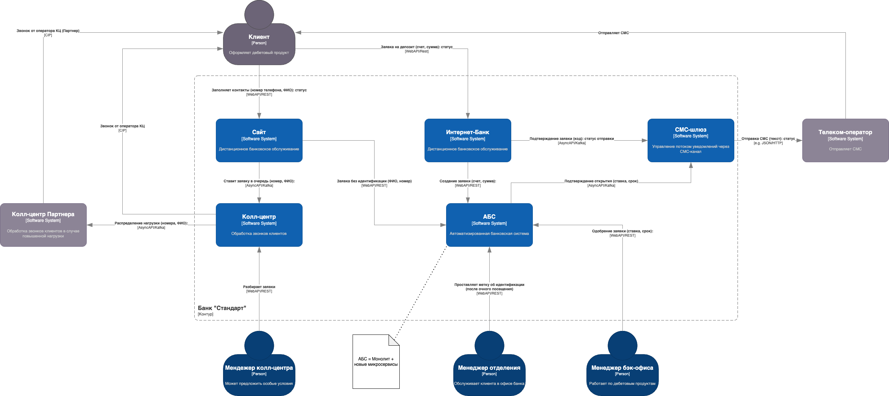
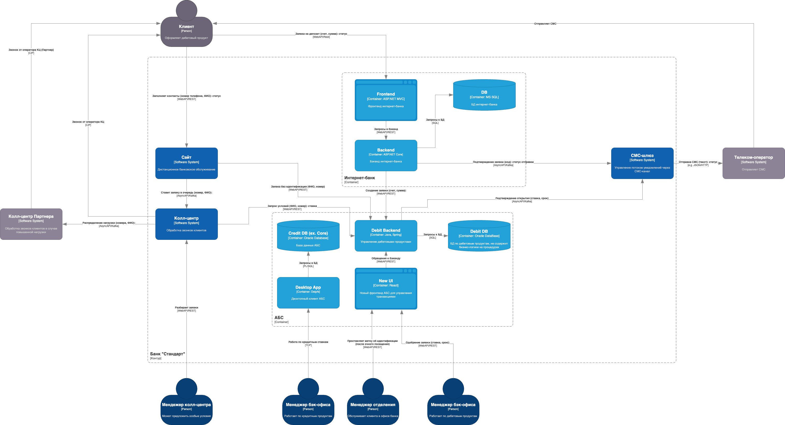

### **Название задачи: Открытие депозита/вклада** 
### **Автор: Королев Сергей Юрьевич**
### **Дата: 01.06.2025**
### **Функциональные требования**

|**№**|**Действующие лица или системы**|**Use Case**|**Описание**|
| :-: | :- | :- | :- |
|1 | Клиент, Сайт| Узнать условия по вкладу| Клиент заходит на сайт Банка и оставляет свои ФИО и номера телефона. Далее ждет обратный звонок с условиями|
|2|Колл-центр, Оператор КЦ, Клиент|Подтверждение для не-клиентов|Оператор проверяет в системе ставку, звонит клиенту и предлагает прийти в отделение для идентификации|
|3|Клиент, Интернет-банк|Подача заявки для клиентов|Клиент выбирает вклад, выставляет сумму и срок|
|4|Менеджер отделения, Клиент, АБС|Идентификация не-клиента|Менеджер проверяет паспорт клиента, сверяет данные из заявки на сайте и проставляет метку об идентификации|
|5|Клиент|Оповещение клиента|Клиент получает оповещения о необходимости прийти в банк либо согласованной ставке|
|6|Менджер бэк-офиса, АБС|Одобрение вклада|Менджер по данным АБС одобряет ставку и срок вклада для клиента|
### **Нефункциональные требования**
Опишите здесь нефункциональные требования и архитектурно значимые требования.

|**№**|**Требование**|
| :-: | :- |
|1|Защита чувствительной информации при передаче данных (сайт, шлюз, интернет-банк)|
|2|Доступность всех систем 99.9%|
|3|Время отклика для клиента - менее 500 ms|
|4|Возможность переключения на резервный ЦОД в случае сбоя|
|5|Обеспечить масштабирование компонентов под растущей нагрузкой|
|6|Использование существующих технологий (MS SQL, Oracle) для интеграции новых решений с имеющимися системами|
### **Решение**
Диаграмма контекста:

Диаграмма контейнеров:

На схемах описаны ключевые компоненты системы, такие как сайт, колл-центры, АБС, Интернет-банк, СМС-шлюз. Так как речь идет об MVP компоненты в основном отрисованы ASIS.

Основной данного решения становится компонент Debit Backend, который обеспечивает обработку и получение данных по ставкам дебетовых продуктов. 

Интернет-банк предлагается не изменять в текущей итерации, кроме минорных интеграций с ним. Они будут реализованы вендором.

Это первый шаг к выделению целевых мироксервисов с отказом от текущего приложения Desktop App, которое очевидно Legacy (даже логика релализована на процедурах БД - антипаттерн, не масштабируется)

Также в рамках МVP предлагается не интегрировать дебетовые и кредитные продукты, т.к. текущая реализация слишком уже не целевая, а обмен данными несколько раз в день между дебитовыми и кредитными менеджерами не сильно тормозит процессы согласования

Кроме того, это решение обосновано трудоемкостью на обеспечение SLA по доступности и отклику (k8s и failover стратегия требуют отдельной проработки)

### **Альтернативы**
1. Интеграция Debit Backend и текущего Destkop App в АБС с паттерном ACL (риски не успеть за полгода)
2. Заняться масштабированием интернет-банка, что может затормозить основную разработку

**Недостатки, ограничения, риски**

1. Отсутствие компетенции по k8s и DR
2. Обучение работе с новой системой
3. Риски утечки данных АБС посредством партнерского колл-центра
