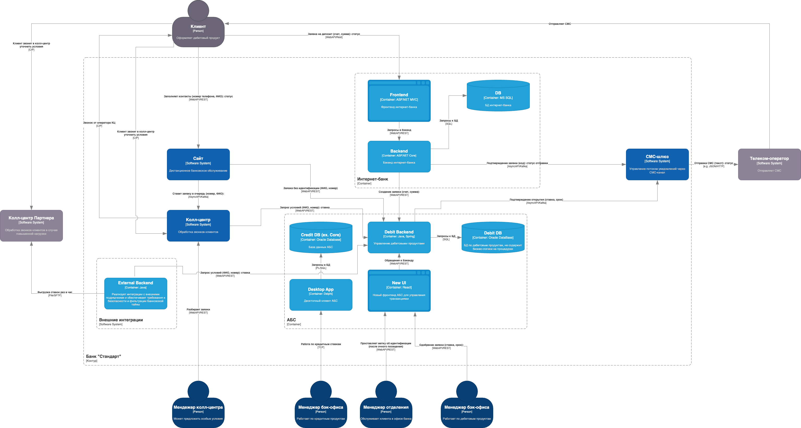

### **Название задачи: Передача ставок в колл-центр** 
### **Автор: Королев Сергей Юрьевич**
### **Дата: 02.06.2025**
### **Функциональные требования**

|**№**|**Действующие лица или системы**|**Use Case**|**Описание**|
| :-: | :- | :- | :- |
|1|Клиент, Колл-центр, Оператор|Консультация о ставках по телефону|Клиент звонит в колл-центр, оператор рассказывает доступные условия по ставкам|
|2|Клиент, Колл-центр, Партнерский колл-центр|Колл-центр перегружен|Если звонков от возрастных клиентов слишком много, то часть поток распределяется на систему Партнера. Оператор также может назвать предлагаемые ставки.|
### **Нефункциональные требования**
Опишите здесь нефункциональные требования и архитектурно значимые требования.

|**№**|**Требование**|
| :-: | :- |
|1|Нет возможности делать API-вызовы|
|2|Обеспечить средства защиты информации при передаче данных|
|3|Задержки в данных не более 1 часа|
|4|Невозможность получить любые атрибуты Банковской тайны|
### **Решение**
Дополненная контейнерная диаграмма к ADR 001:

Ключевые доработки связаны с невозможность вызовов API для внешнего колл-центра, а также выделение интеграционного компонента реализующего средства защиты передаваемых данных. Ставки передаются раз в час файлом csv.

### **Альтернативы**
1. Прямой доступ для внешнего КЦ к Debit Backend (= утечка Банковской тайны)
2. Получение ставок не из Debit DB, а из системы внутреннего КЦ (вне капабилити этой системы, некорректно с точки зрения корп. архитектуры)

**Недостатки, ограничения, риски**

1. Устаревание ставок с окном в 1 час
2. Реализация задания по безопасности, регуляторные риски

